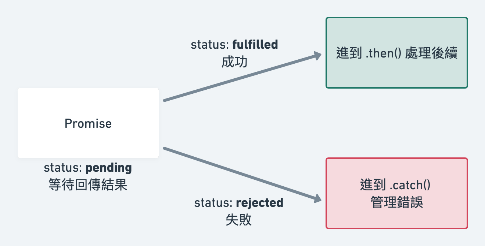

:::info
本系列文章先以準備面試、快速回顧為主，行文較為簡略，前後的脈絡跟邏輯若有跳躍之處，敬請見諒
:::

## callback hell

```js
const callbackHell = () => {
  setTimeout(() => {
    console.log("這就是...callback hell");
    setTimeout(() => {
      console.log("callback 裡面包著 callback");
      setTimeout(() => {
        console.log("再包著 callback");
        setTimeout(() => {
          console.log("又包...");
          setTimeout(() => {
            console.log("直到你的程式碼...");
            setTimeout(() => {
              console.log("變成龜派氣功");
              setTimeout(() => {
                console.log("かめはめ波 !!!");
              }, 3500);
            }, 3000);
          }, 2500);
        }, 2000);
      }, 1500);
    }, 1000);
  }, 500);
};

callbackHell();
```

## Promise 來解救你

Promise 是在 ES6 新增的語法，旨在優化非同步語法，解決 callback hell 的狀況，使用 `.then()` / `.catch()` 的鏈式 method 來讓順序有條有理，增加可讀性跟維護性

## Promise 圖解



Promise 就像一個點餐拿到的號碼牌，但就只是一份號碼牌，並不保證後續是否能拿到餐點

一個 Promise 物件分為三種狀態:

1. **pending**
   - 拿到號碼牌了，正在候餐，但不一定吃得到
2. **fulfilled/resolved**
   - 事件執行完畢且**操作成功**，回傳 `resolve`  的結果（已經被 fulfilled ）
   - 成功完成上菜
3. **rejected**
   - 事件執行完畢但**操作失敗**，回傳 `reject`  的結果
   - 店家有接受到訂單，但看了一下發現賣完了

可以知道的是，一個 Promise 物件必定會先經過 `pending` 狀態，再依照操作回傳結果（例如 API 有無回傳正確資料）決定狀態是 `fulfilled` 還是 `rejected`

要注意的是，Promise 物件的狀態變化是不可逆的，如果從 `pending` 變為 `fulfilled` 或是 `rejected` 其一，狀態就不會發生變化

### 如何建立一個 Promise

Promise 是從建構函式 **new 出的物件**

```js
const p = new Promise(function(resolve, rejected){
  if(/* Success */) {
    // 如果操作成功, 就調用 resolve, 並回傳 value
    // value 在 .then() 可以被取得
    resolve(value);

  }
  else{
    // 如果操作失敗, 就調用 reject, 並回傳 error
    // error 在 .catch() 可以被取得
    reject(error);
  }
});
```

1. Promise 需使用 new 建構子
2. Promise 接受一個 callback 函數做為參數
3. 該 callback function，又會接受兩個函數做為參數，由 Promise 傳入，慣例上以 `resolve`, `reject` 取名
4. `resolve`, `reject` 又稱為執行函式 ( executor function )

## 範例

```js
const mockCallAPI = new Promise((resolve, reject) => {
  const isSuccess = Math.random() > 0.5 ? true : false;

  if (isSuccess) {
    resolve({
      status: "success",
      data: {
        name: "Alex",
      },
    });
  } else {
    reject(new Error("失敗了 QQ"));
  }
});

mockCallAPI.then((res) => console.log(res)).catch((err) => console.log(err));
```

- 建立一個 Promise，以隨機亂數決定成功失敗
- 若成功，調用 `resolve`，並塞入回傳 result
  - 該 result 就會在 `.then` 做為 callback 的預設參數傳入
- 若失敗，調用 `reject`，並塞入回傳 result，通常是 error
  - 該 result 就會在 `.catch` 做為 callback 的預設參數傳入

在 [codesandbox](https://codesandbox.io/s/promise-intro-gk1ei8?file=/src/index.js) 嘗試看看

## 補充

`.then()` 也可以放入兩個 callback function 一個是 `fulfilled` 執行，一個是 `rejected` 執行

但是通常不太會這樣寫， `rejected` 實務上通常放到 `.catch()` 處理

```js
.then(
  success=>{console.log(success)},
  error=>{console.log(error)}
)
```

## Reference

[卡斯伯 - JavaScript Promise 全介紹](https://www.casper.tw/development/2020/02/16/all-new-promise/)
